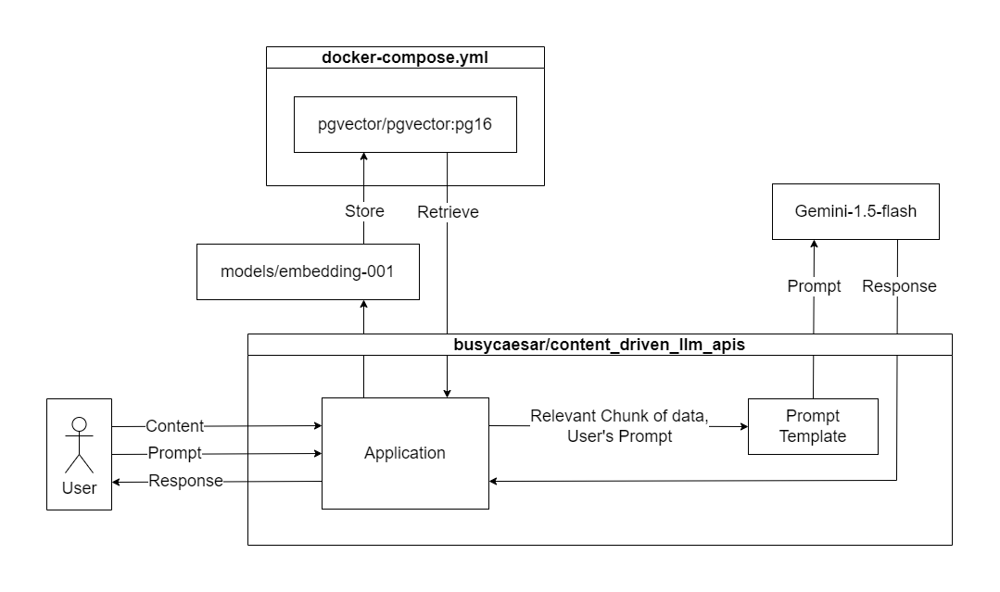

# Content Driven LLM APIs

## Description
This project offers a set of developer-friendly APIs that enable users to interact with a Large Language Model (LLM) using their own content. Users can submit text, which the system stores. When a question is posed, the system retrieves the content and leverages the LLM to generate a response based on that information.

## Features
- Store and manage content
- Prompt LLM and get responses based on the stored content

## System Diagram

## Tech Stack

## [API Documentation](./api-documentation.md)

## [Project Documentation](./documentation.md)

## Future Plans
This project abstracts away the complexities of working with LangChain and language models. Developers can integrate advanced LLM functionality into their applications without needing deep knowledge of LangChain or how to connect with language models.

## Author
[Dev Shah](https://github.com/busycaesar)
