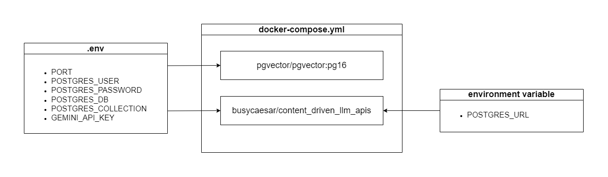

# Project Documentation (In Dev.)

To use API services provided by the project, just need to pull a few images from DockerHub, set up the `docker-compose.yml` file, pass required environment variables and run the containers. Following is the setup architecture. It representations how the project setup looks like.



Following are the step by step instructions for setting up the project.

1. Create a `docker-compose.yml` file in a new folder. List the required images and add the required parameters as shown below

```yml
services:
  # Vector DB for storing chunks and embeddings
  db:
    image: pgvector/pgvector:pg16
    restart: always
    env_file:
      - .env
    ports:
      - "5432:5432"
    volumes:
        # You can name the volume anything.
      - llm_project_demo:/var/lib/postgresql/data

  # To store the content and prompt the LLM.
  content_driven_llm_api:
    image: busycaesar/content_driven_llm_apis:latest
    restart: always
    env_file:
      - .env
    # Pass 'POSTGRES_URL' separately because it changes based on where the pgvector is hosted. Since we are listing both the images in docker-compose.yml file, the application will be able to access the pgvector using the 'db' domainname as we named the pgvector image, 'db'. Additionally, the port number is 5432 as pgvector is hosted on that port number. 
    environment:
      - POSTGRES_URL=db:5432
    ports:
      - "8080:8080"
    # Make sure that the image starts building only after the db's image is ready so it can access it through the same credentials using to setup the pgvector.
    depends_on:
      - db

volumes:
  llm_project_demo:
```

2. Create `.env` file to list all the required environment variables.

```.env
PORT=8080

# Database Related Variables.
# You can give any value to these variables. Once the volume is created using these variables, you will be able to access the pgvector only using these values, unless you delete the existing volume and create a new one.
POSTGRES_USER=llm_vectordb_user
POSTGRES_PASSWORD=llm_vectordb_passwd
POSTGRES_DB=llm_vectordb_db
POSTGRES_COLLECTION=llm_vectordb_documents

# LLM API Key
GEMINI_API_KEY= # Paste your Gemini API Key here.
```

3. Once both the files are setup and `Docker Desktop` is started, you can run the following command to run all the containers.

```bash
docker compose up --build
```

4. If this does not thorw any error, you should be able to access the APIs provided by the application on `localhost:8080`. You can run the health check to make sure that the application is healthy. For using the APIs check out the [API Documentation](./api-documentation.md).
